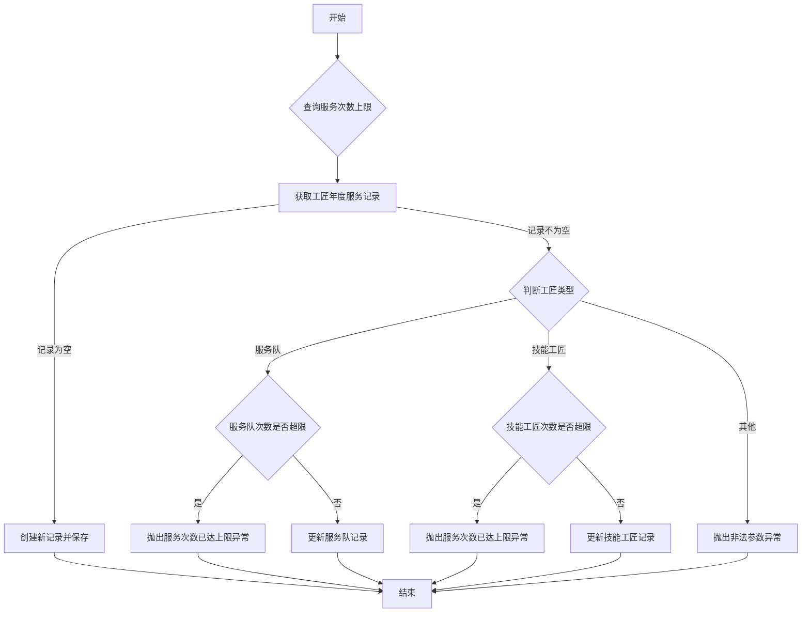

# 1. 需求发布

```java
@Override  
@Transactional(rollbackFor = Exception.class)  
public Boolean addDemand(DemandAddReq addReq) {  
    // 校验参数  
    checkParam(addReq);  
    // 期望工匠服务次数需要大于一次  
    demandCraftsmanServiceRecordService.updateOne(addReq.getCraftsmanId(),  
            addReq.getCraftsmanType(), getYear(), addReq.getCreateArea(), 1);  
    DemandDO demandDO = Convert.convert(DemandDO.class, addReq);  
    demandDO.setEnterpriseId(SecurityFrameworkUtils.getLoginUPId());  
    // 新增数据状态审批中  
    demandDO.setStatus(DemandStatusEnum.CRAFTSMEN_PENDING.getCode());  
    this.save(demandDO);  
    // 写入一条  
    DemandAuditDO demandAuditDO = new DemandAuditDO();  
    demandAuditDO.setDemandId(demandDO.getId());  
    demandAuditDO.setNode(DemandAuditNodeEnum.SUBMIT.getCode());  
    demandAuditDO.setAuditTime(LocalDateTime.now());  
    // todo 企业类型  
    demandAuditDO.setApproveType(DemandApproveType.DEMAND_ENTERPRISES.getCode());  
    demandAuditDO.setApproveId(SecurityFrameworkUtils.getLoginUserId());  
    demandAuditDO.setStatus(DemandAuditStatusEnum.SUBMIT.getCode());  
    demandAuditDO.setCreateArea(addReq.getCreateArea());  
    demandAuditService.save(demandAuditDO);  
    return Boolean.TRUE;  
}
```
## 整体逻辑
checkParam参数校验，内部逻辑：
- 校验期望服务时间不能小于当前时间
- 如果当前企业为链主企业，则还需要判断是否点亮。 
- 检查期望工匠，如果未点亮||已停用reponse：期望工匠不符合要求
updateOne查询并判断工匠是否可以服务。



将记录改为待审核，并创建一条需求审核记录。