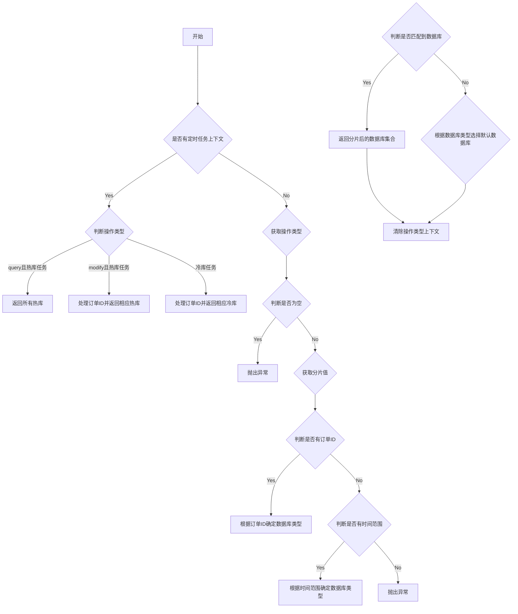

	
# 冷热分离业务背景
跨境付款为支付宝国际事业部的核心业务，整合了出国留学、国际捐款、跨境红包、打通香港、留学缴费等业务，其中的订单表数据库使用阿里云MYSQL版本RDS ，由于去年支持积分支付，业务持续扩张，存储层容量将在半年内到达系统瓶颈，且单实例存储层已无法扩容(所购规格最大支持6T磁盘)磁盘使用率70%。
内部也做了分库分表，但是分库分表的单表最大上限只有6TB，如果无脑去新增库表，自然可以解决问题，但是本质上的问题解决不了，随着时间推移只能继续增加分库分表，并且基于成本考虑目前需要一个方案来节省成本。
所以内部讨论了一下项目这次需要解决的问题（项目目标）
# 项目目标

和小伙伴们讨论了一下目前项目的目标要解决的问题
- 突破存储瓶颈：解决单实例无法扩容问题，降低存储成本（6TB）
- 业务稳定性诉求：改造过程上层业务基本无感知，数据不丢失（这个肯定是必须要做的）
- 架构扩展性诉求：改造方案是可持续的，业务持续增长后依然适用（解决本质问题，不能靠扩瞳）
目标有了之后就开始方案调研了嘛，然后主要是根据目前现状梳理在做方案技术选型。
# 方案调研
## 现状梳理
- 库表规则


- 数据表梳理
主表是每个订单都会有一条记录，扩展表是特定业务场景才会有数据，扩展表数据较少，因此考虑先对主表数据进行迁移。现状梳理好了之后开始技术选型。


- 主表
	- 订单主表
	- 订单明细表
	- 账务流水表
	- 账务信息
以下留个印象
-  3.4.1 账户信息表csxiiitwelvetran_account_info_dev_single

|              |               |       |      |
| ------------ | ------------- | ----- | ---- |
| 字段           | 类型            | 是否允许空 | 描述   |
| account_id   | bigint        | N     | 自增主键 |
| gmt_create   | timestamp     | N     | 创建时间 |
| gmt_modified | timestamp     | N     | 修改时间 |
| user_id      | varchar(40)   | N     | 用户id |
| balance      | decimal(10,0) | N     | 账户余额 |

- 3.4.2 账户流水表csxiiitwelvetran_account_manage_dev_single

|                 |               |       |         |
| --------------- | ------------- | ----- | ------- |
| 字段              | 类型            | 是否允许空 | 描述      |
| id              | bigint        | N     | 主键      |
| gmt_create      | timestamp     | N     | 创建时间    |
| gmt_modified    | timestamp     | N     | 修改时间    |
| from_user_id    | bigint        | N     | 转出用户id  |
| from_account_id | bigint        | N     | 转出账户id  |
| to_user_id      | bigint        | N     | 转入用户id  |
| to_account_id   | bigint        | N     | 转入账户id  |
| amount          | decimal(10,0) | N     | 转账金额    |
| status          | varchar(20)   | N     | 转账状态    |
| order_id        | bigint        | N     | 订单id    |
| to_balance      | decimal(10,0) | N     | 转入方当前余额 |
| from_balance    | decimal(10,0) | N     | 转出方当前余额 |
| serial_id       | varchar(255)  | N     | 流水号     |
## 方案技术选型
就之前说了现状，订单库目前共8实例，32个DB，然后内部讨论了一下主要可以从横向拆分、数据治理以及冷热分离几个方面进行考虑，考虑到改造时间和成本因素最终决定先做冷热分离，后续再进行无效数据治理。

|      |                                         |                         |                                |
| ---- | --------------------------------------- | ----------------------- | ------------------------------ |
| 方案比较 | 实现成本                                    | 数据收益                    | 风险性                            |
| 横向扩容 | 开发成本低，资源成本高，需要再购买8实例                    | 可降低50%占用                | 改造风险较低，但未来还是会面临磁盘空间问题          |
| 数据治理 | 开发成本高，周期长，收敛无效订单使用场景，对无效数据进行单独冗余存储      | 按下单到播单1：10计算，主表约减少90%数据 | 风险较高，需业务上下游梳理这类订单使用场景，同时新增查询方式 |
| 冷热分离 | 开发成本高，不依赖上下游服务改造，需新增存储库存储老数据，并兼顾业务更新和查询 | 随着时间推移，数据收益会越高          | 风险较高，但解决彻底，热库只存储一段时间的数据        |
# 冷热分离存储
考虑到冷热分离就肯定要考虑到存储，因为冷热分离实际上就是热数据存在高性能的数据库，冷数据放在稍弱一点的数据库，这样冷数据就不会占用热数据的资源，本质上也是节省成本了。
基于现有的阿里云产品，我们使用RDS+[X-Engine](https://help.aliyun.com/document_detail/148404.html?spm=5176.12818093.help.dexternal.5adc16d0e3VBx0)来存储冷数据（钉钉、淘宝交易也是使用该方案，参考[X-Engine如何支撑钉钉跃居AppStore第一](https://help.aliyun.com/document_detail/161317.html?spm=a2c4g.11186623.6.638.32682b0aLErroL)），**X-Engine压缩比能到达10%到50%**，同时保证一定的读写性能。
> 为什么使用rds+x-engine引擎？

数据存储压缩技术比较常见，使用压缩算法对元数据及索引压缩，压缩和解压过程增加CPU开销，用更多的计算时长换取更小的空间，数据压缩比与压缩算法及数据特征相关，以下列举部分存储压缩技术。

|                                                                                                         |               |                                     |
| ------------------------------------------------------------------------------------------------------- | ------------- | ----------------------------------- |
| 压缩选型                                                                                                    | 压缩比(相比innodb) | 适用场景                                |
| [innodb压缩](https://dev.mysql.com/doc/refman/5.6/en/innodb-introduction.html)                            | 25％~ 50％      | 大字符类型数据表，事务并发度要求不高                 |
| [archive](https://dev.mysql.com/doc/refman/5.6/en/archive-storage-engine.html)                          | 1/10~1/15     | 只支持INSERT和SELECT，不支持UPDATE，比如统计数据收集 |
| [tokudb](https://www.percona.com/software/mysql-database/percona-tokudb)                                | 大约25%         | 读多写少场景，追求高压缩比                       |
| [X-Engine](https://help.aliyun.com/document_detail/148660.html?spm=a2c4g.11186623.6.613.7a0818e3lomT3M) | 10%~50%       | 阿里云自研数据库存储引擎，适用大规模数据以及高并发场景        |

# 冷数据区间
冷热分离很重要的一点是冷数据的区间划分。
主要是有三个方案：
- 冷库存全量，热库存N天之内的数据
	- 优点
- 冷库存N天之外的数据，热库存N天之内的数据
- 冷热库以N天作为分隔区间，但是对部分区间数据冷热都做数据冗余。


方案二风险较高，对比方案一和三，考虑到数据同步成本最终选用方案三，对冷热数据进行部分冗余，由于用户只会查询近期订单，最终选取120天(实现时可云控配置)作为临界点，90天之外数据存储冷库，120天内数据存储热库，冷热冗余30天数据。这个90天作为划分点主要是经验值。
# 冷热分离规则
用数据创建时间gmtCreate字段(业务表均已支持)作为分隔依据
- 热区存储120天内数据，冷区存储90天外数据，其中热数据多出的30天数据作为冷热共存区域
- **冷热冗余30天共存数据是防止异常情况下数据丢失情况，共存区更新时冷热库均需要更新**（这个重点一定要讲出来）
	- 如果你不冗余数据只单纯以90天为划分节点，90天查热数据90天外查冷数据，假设说你每天定时任务冷热分离失败，你查询90天外的数据会去查冷数据库，而冷数据库冷热分离失败导致没有数据，所以你会查不到数据，但是如果冗余了30天，90为界限，120天内查热数据，在假设刚刚场景，依然冷热分离失败现在冷数据没数据，而你可以通过热数据查的到，因为冗余了30天的数据，就算失败了也能从冗余的30天里查到数据，而失败的数据后续会通过补偿手段进行补偿，并且你有30天的补偿容错。
- 状态非终态订单存储热库(未完成订单查询更新频率高，终态订单更新场景少，比如退款)

数据分区示意图


既然现在分了冷热库query操作和写操作都要变化，比如原先部分冷热库读写都是从一个库里做操作。
现在查询：120内查热库，120天外查冷库。
写：90天内的数据写热库，90天外冷热库一起写。接下来我详细说一下读写流程
有个dao-sdk统一访问请求，然后proxy根据规则路由冷热数据库，这部分怎么实现的呢？
通过 **Sharding-JDBC** 实现冷热数据库的路由是可行的。Sharding-JDBC 提供了强大的分片和路由功能，可以通过自定义分片策略来实现冷热数据的动态路由。以下是实现思路和具体步骤：

### 实现思路

1. **定义冷热数据库数据源**：配置冷库和热库的数据源信息。
    
2. **自定义分片策略**：通过实现 `HintShardingAlgorithm` 接口，根据业务逻辑（如时间字段）动态决定将请求路由到冷库还是热库。
    
3. **使用 HintManager**：通过 `HintManager` 在运行时动态指定分片值，实现强制路由。
    

### 具体实现步骤

#### 1. 配置冷热数据库数据源

在 `application.yml` 中配置冷热数据库的数据源：

yaml复制

```yaml
spring:
  shardingsphere:
    datasource:
      names: hotDb, coldDb
      hotDb:
        type: com.zaxxer.hikari.HikariDataSource
        driver-class-name: com.mysql.cj.jdbc.Driver
        jdbc-url: jdbc:mysql://host1:3306/hotDb?useSSL=false&serverTimezone=UTC
        username: root
        password: root
      coldDb:
        type: com.zaxxer.hikari.HikariDataSource
        driver-class-name: com.mysql.cj.jdbc.Driver
        jdbc-url: jdbc:mysql://host2:3306/coldDb?useSSL=false&serverTimezone=UTC
        username: root
        password: root
```

#### 2. 自定义分片策略

实现一个自定义的分片算法类，根据业务逻辑（如时间字段）决定路由到冷库还是热库：

java复制

```java
public class ColdHotShardingAlgorithm implements HintShardingAlgorithm<String> {
    @Override
    public Collection<String> doSharding(Collection<String> availableTargetNames, HintShardingValue<String> shardingValue) {
        Collection<String> result = new ArrayList<>();
        String time = shardingValue.getValues().iterator().next();
        if (isHotData(time)) {
            result.add("hotDb");
        } else {
            result.add("coldDb");
        }
        return result;
    }

    private boolean isHotData(String time) {
        // 根据时间字段判断是否为热数据（例如：120天内）
        库就找到了，然后在根据分片键去找对应的表，我c端产品一般都是查自己的订单什么的，所以按理来说是安装用户id做查询，如果非要按照订单id可以采用基因法，如果是买家买家可以采用映射方式，单独一个卖家数据库，然后用binlog或者flink做数据同步，卖家数据库可以采用hbase这种专门查询，因为卖家的库基本上不会涉及写操作，所以可以使用hbase
        return true; // 具体逻辑根据业务需求实现
    }
}
```

#### 3. 配置分片规则

在 `application.yml` 中配置分片规则，使用自定义的分片算法：

yaml复制

```yaml
spring:
  shardingsphere:
    sharding:
      tables:
        your_table_name:
          database-strategy:
            hint:
              algorithm-class-name: com.yourpackage.ColdHotShardingAlgorithm
```

#### 4. 使用 HintManager 动态路由

在业务代码中，通过 `HintManager` 动态设置分片值：

java复制

```java
HintManager hintManager = HintManager.getInstance();
hintManager.addDatabaseShardingValue("your_table_name", "2025-02-22"); // 示例时间字段
// 执行数据库操作
hintManager.close(); // 清理 ThreadLocal 中的上下文
```
# 读写流程
（1）访问流程


1. 由于冷热共存区涉及到双写，并且是不同数据库，所以涉及到分布式事务。
2. 使用RPC更新共存区时涉及到分布式事务，一致性如何保证？ 从查询流程可以看出120天内只查询热库，因此冷热共存区更新时热库成功·冷库失败业务暂无影响，**冷库只需保证最终一致性，冷库更新异常(失败或超时)时热库事务不回滚，发送延时消息进行数据校验补齐**，冷区和热区更新不涉及跨库更新

冷库更新可否考虑使用消息进行更新？（了解）

使用消息方式进行异步更新时可能出现丢失、逆序等问题，且接口调用成功时事务并未执行，上游业务查询时返回脏数据可能引发异常问题(比如退款后查询订单实收金额)。

用伪代码表示分离后订单维度查询和更新逻辑，从查询逻辑可以看出，**120天内需保证热库数据准确，120天外需要保证冷库数据准确，共存区只做冗余，保证最终一致性即可。**
所有都可以通过mybatis拦截器，执行sql之前判断是冷数据还是热数据，如果是热数据，直接执行，如果是冷数据则调用rpc然后return rpc的结果。
如果冷热都要，那么优先返回热数据的更新结果，然后调用rpc远程更新。
这个过程需要保证事务的一致性，事务可以通过最终一致性来保证，最终一致性的话可以通过演示消息进行数据补齐。
```
currTime:系统当前日期
orderTime:订单日期(订单号前6位)
coldDb:冷库
hotDb:热库
//查询场景,120天(左闭右开)查询热库，否则更新冷库
if (currTime - orderTime) ∈  [0，120）
return hotDb
else 
return coldDb
//更新场景，120天内(左闭右开)更新热库，90天外(左闭右开)更新冷库，共存区需同时更新
if (currTime - orderTime) ∈  [0，120）
return hotDb
if (currTime - orderTime) ∈  [90，∞ ）
return coldDb
```

# 风险点分析
## 如果不传订单id的情况下怎么做查询？
路由规则肯定可以做到，但是时间要怎么去查询呢，难道默认查4个月的订单吗？也就是说第一次传一个月，第二次传入    
## 以月为维度的查询
  
1.用户维度查询是传入月份有可能会出现跨库查询的情况，比如四个月的时间就是120天嘛，但是考虑到可能会出现一个月31天这种情况，所以实际天数是会比120天多，多出的几天需要去冷库查询，如为了避免单月不进行跨库查询，只查询热库或者冷库？
以下用10月进行举例，其它月份类似。

- 当前日期是10月1日，当前月份为10月，则10、9、8、7查询热库，跨越(1+30+31+31) 93天
- 当前日期是10月15日，当前月份为10月，则10、9、8、7查询热库，跨越(15+30+31+31) 107天
- 当前日期是10月31日，当前月份为10月，则10、9、8、7查询热库，跨越(31+30+31+31) 123天
**解决方案**：将删除推迟一周
热库存储120天数据，能覆盖3个月但无法覆盖完整的4个月(比如7到10月共123天)，为了保证热库数据能完整覆盖4个月，需要将删除推移一段时间(目前为一周)，比如当热数据达到127天的时候才会被热数据中删除。

## 订单创建时间是11.59而gmtCreate字段是12.01的临界情况
如果时间不一致，我们查询是根据订单的前六月约定时间进行查询，而冷热分离的时候是根据实际的gmtCreate时间进行冷热分离，所以可能会出现冷热分离的时候根据gmt分离已经分到冷库，而查询查询和写操作是根据订单约定前六位进行冷热路由，订单创建时间是11.59路由到热库，而gmt为下一天的12.01数据在冷库，热库数据被删除，导致查不到。
那么对于这个问题也分析了一下，订单号时间主要是订单维度查询或者更新，gmtCreate使用场景是数据迁移(每天迁移Y-90天的数据)和删除(每天删除Y-127天的数据)，以下分析临界情况。
所以主要分四个边界情况：
- 订单号位于0-89天，gmtCreate位于0-90天（无影响，均查询热库，但是数据会被提前一天迁移到冷库）
- 订单号位于0-90天，gmtCreate位于0-91天（无影响，原因同上）
- 订单号位于0-119天，gmtCreate位于0-120天(无影响，热库数据删除127天之后的数据，并未立即删除，订单号路由到热库仍能够查询更新)
- 订单号位于0-120天，gmtCreate位于0-121天(无影响，数据均位于冷库，查询更新均走冷库)

  为什么这里边界是120天而不是121天呢？，因为这里127是为了按月维度查询出来的东西，正常情况下按行查询依旧是按照120热数据为维度。所以无需担心查询127天的边界值。
  ## 冷热分离之后分页查询风险点
  由于数据做了日期上的冷热分离区分，这会导致分页查询别的非常困难，像滚动分页这种情况，所以我们也做了前端改造，前端查询的时候增加日期，按照月份这样，分页的时候要么就是冷数据，要么就是热数据
  ## 数据迁移风险点
  - 先全量数据迁移，需要将历史数据均同步至冷库，可采用DTS或定时任务进行数据同步，业务采用定时任务进行同步(冷库数据表hash规则有调整)，迁移完成进行校验比对并灰度冷库读写流程， 均无异常后删除历史数据。
  - 增量热数据迁移,每天凌晨迁移当前日期前90天数据，使用定时任务自动迁移，为减少迁移过程影响在线库性能，每个实例创建一个子任务进行串行迁移。
## 数据校验

- 对于当前日期90天前的数据进行迁移，数据迁移完后开启校验任务对冷热库进行字段校验，冷热库数据不一致时以热库为准进行数据修复。

## 数据删除

- 热数据删除，超过127之后的数据，**删除前校验冷库是否已存在该数据**。

## 磁盘优化

数据删除后磁盘空间不会真正释放，因此需要做[optimize优化](https://dev.mysql.com/doc/refman/8.0/en/optimize-table.html)，虽然Mysql5.7版本online DDL支持optimize，但考虑到回收过程对数据库性能仍会有影响，因此业务使用从库(无业务使用)定期进行磁盘回收，在业务低峰期进行主从切换实现主库磁盘回收。
## 冷热分离的一致性保证
现在就俩个操作，热数据删除，冷数据添加，这俩步任何一步失败，比如热数据删除失败，冷数据成功，无伤大雅。
热数据删除成功冷数据添加失败，这个情况存在吗？
冷数据迁移有37天容错，并且热数据删除前会判断冷库是否存在。
热数据被删除，冷数据还没迁移到冷库：实际上这种情况基本不会存在，因为我们在删除热库数据之前会去判断冷库是否有当前数据，有的话才删除。
# 结果
数据库磁盘由95%降低到65%，磁盘储瓶颈问题得以缓解(目前还未将数据完全迁移，历史数据仍在删除中)，目前热库实例配置32核128G，磁盘6T，冷库实例配置4核16G，磁盘8T，并且冷数据访问查询RT小于20ms，更新小于RT150ms。


将冷模块实现热模块所有接口。这样就能保证接口一致性
# 路由算法代码实现
	mybtais 拦截器+自定义路由算法
分库字段为：gmt_time userId orderId



## 重点一：为冷热库的区分
我这里是根据时间来判断冷热库，目前分三个场景：
- 传入 orderId：对应着订单维度
- 传时间：对应着后台维度，需要判断是否有传入 userid 或者 orderid，有的话直接根据这俩进行路由，否则全冷库或者全热库，或者全冷热库
- 传 userId+时间：对应着用户维度查询，需要判断是否有传入 userid 或者 orderid，有的话直接根据这俩进行路由，否则全冷库或者全热库，或者全冷热库（需要前端取舍四个月）

## 重点二：怎么判断SQL语句是查询还是写？
通过mybatis 拦截器解析 sql 如果包含 select 就是查，这种逻辑
## 重点三：自定义路由算法
这里需要自定义路由算法
时间决定冷热库
id 决定路由的具体库表

# 定时任务迁移数据
迁移数据逻辑，先查出热库90天外的数据 添加到冷库。
然后删除热库127天外的数据，删除之前查看冷库是否存在，不存在不允许删除。
一致性问题：首先我有37天的容错重试，其次如果真失败了我会记录日志通过人工来查看原因并处理。